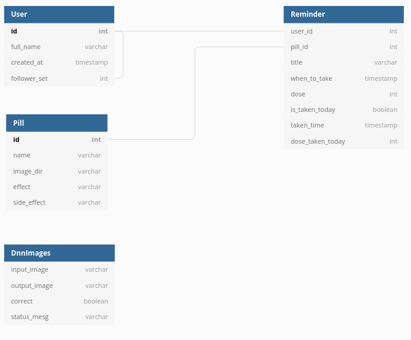

# Backend Server with Django
This is the code repository for the backend that serves the React Native clients. We implemented with Pythong Django and developed REST APIs using the django-rest-framework. For a summary of the code and the overall structure, keep reading!

## Requirements and Database Schema

The requirements for the backend server are... 
- Store user accounts, pill entries, and intake reminders for each pill.
- Perform CRUD for pills and reminders through REST API request/responses.
- Provide response messages containing intake information when requested by NUGU AI speakers.
- Receive images from clients and perform object dection, sending back result images marked with X and O on each pill.

The database schema is not that complicated, comprising of one table for user accounts, and others to store user registered information such as pills, intake reminders and images used for object detection inference.

## CRUD with REST API

### User Model
+ accounts 
    + User
      + model : abstractuser로 불러오기 -> 보호자, 피보호자
      + serializer : signup serializer 
      + url : 
        + accounts/signup
        + accounts/follow
        + accounts/unfollow
        + accounts/search

### Pill, Reminder Model
+ pharmasee
    + model : pill, reminder 
    + serializer : pillserializer, reminderserializer
    + url : router 사용 -> api/pills, api/reminders, pharmasee/search
    + view : modelviewset 사용 

## Image Transfer Between Client and Server

### DnnImage Model
- API testing results with Postman

## AI Speaker Configuration & Proxy Server
nugu   
play builder
api test results 
   

## Deployment with AWS Lightsail
